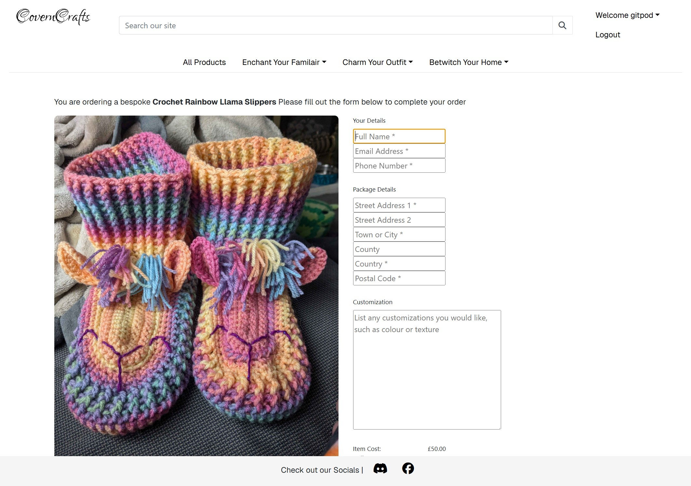

# CovenCrafts

CovenCrafts is your enchanting haven for handmade crochet creations with a spooky twist! From adorable plushie Familiars to intricately crafted gothic decor, each piece is lovingly designed to bring a touch of magic and mystery to your life. Perfect for Halloween enthusiasts, witchy vibes, or anyone who adores the eerie and unique. Step into the world of CovenCrafts and discover handcrafted treasures that are both hauntingly beautiful and irresistibly cosy.

I built this website to facilitate bespoke crafting creations made by the extremely talented people in my social circle. The idea is that they can upload their own creations and receive payment via bespoke comissions. everything is made to order with an option to as for alterations that the crafter can make. My goal is to put the power directly in the crafter's hands as much as the customers. So that a crafter can create a listing out and about on a mobile or tablet while at a market stall, hand the device over to the customer and make the sale there and then, as well as have a website that customers can be referred to.

All of the crafters are hobbyists who make things for the love of crafting. None of them express a desire to make this a full time and main source of income and instead want a tool to augment their current volume.

[View CovenCraft on Heroku here](https://covencrafts-41bf1dffbe2d.herokuapp.com/)

---

## CONTENTS

* [User Experience](#user-experience-ux)
  * [User Stories](#user-stories)

* [Business Plan](#business-plan)

* [Development](#development)

* [Design](#design)
  * [Colour Scheme](#colour-scheme)
  * [Typography](#typography)
  * [Imagery](#imagery)
  * [Wireframes](#wireframes)

* [Features](#features)
  * [General Features on Each Page](#general-features-on-each-page)
  * [Future Implementations](#future-implementations)
  * [Accessibility](#accessibility)

* [Technologies Used](#technologies-used)
  * [Languages Used](#languages-used)
  * [Frameworks, Libraries & Programs Used](#frameworks-libraries--programs-used)

* [Deployment & Local Development](#deployment--local-development)
  * [Deployment](#deployment)
  * [Local Development](#local-development)
    * [How to Fork](#how-to-fork)
    * [How to Clone](#how-to-clone)
* [SEO](#seo)

* [Testing](#testing)

* [Credits](#credits)
  * [Code Used](#code-used)
  * [Content](#content)
  * [Media](#media)
  * [Acknowledgments](#acknowledgments)

---

## User Experience (UX)

CovenCrafts is dedicated to providing an intuitive and enjoyable shopping experience for enthusiasts of handmade crochet spooky items as well as a quick and easy way to take commissions and make a sale while out and about in craftfairs.

Key Features
* Responsive Design: Ensures seamless browsing across various devices, including desktops, tablets, and smartphones.
* Intuitive Navigation: Simplifies product discovery through clear categories and a straightforward menu structure.
* Detailed Product Pages: Offers comprehensive information, high-quality images, and customer reviews to assist informed purchasing decisions.
* Secure Checkout Process: Provides a streamlined and safe transaction experience with multiple payment options.
* Accessibility Considerations: Incorporates best practices to ensure the site is usable by individuals with diverse abilities.

### Bespoke-Centered Design Approach

* Iterative Design Process: Implementing continuous improvements based on user testing and behavior analysis.
* Consistent Visual Identity: Maintaining a cohesive and appealing aesthetic that reflects the brand's spooky and handmade essence.

### User Stories

[User Stores for development can be found here:](https://github.com/users/LaurieAnderson92/projects/8/views/1)

#### Client Goals
* Navigate the site smoothly and check out with minimal friction.
* Access detailed descriptions, high-quality images of products
* Feel confident that their payment information is handled securely.
* Easily browse and find handmade spooky crochet items that match their interests.
#### Crafter Goals
* Present handmade spooky crochet items in a visually appealing and professional manner.
* Encourage repeat purchases and build a loyal customer base through promotions or social media integration.
* Add, update, and remove products efficiently with tools for managing product details.
#### Site Admin Goals
* Protect customer data and transactions with up-to-date security measures.
* Manage marketing efforts, newsletters, and social media campaigns.

## Business Plan

To provide a simple, affordable, and efficient platform for crafters to showcase their handmade creations, manage commissions, and connect with customers, all while maintaining flexibility for their side business.

CovenCraft is an app designed for my friends who are hobbyists. They wish to sell their handmade goods and take commissions without the complexities of managing a full-fledged business. The app emphasizes ease of use, low costs, and minimal time investment, catering to their on the fly needs for this side hustle. It's meant to be a low-cost, easy structure with no mandatory subscription fees—commission-based pricing to align with the users' side business model. It also links to a discord group that has been used to take commissions, so future integration with that would be idea.

Revenue wise, this is a passion product of mine to make their lives easier so no Commission on Sales is Taken. The delivery cost is caulated on the fly using their qyuick mental pricing of £10 or 10% of the cost, whichever is greater as the cost of the commission directly corolates to the size of the commission.

By having a web page, it becomes one step closer to becoming a ltd company, A portion of any Savings made from VAT will flow into the upkeep of this app and treats for their eager pet fullstack developer

A mock FB page was made and linked in the deployed version. Facebook may delete fake store pages so I have left a screenshot below:

[Facebook Page for Crafting Covern](assets/documentation/facebook_page.png)

## Development

Agile priciples were followed for this app, however I tried to splut off brances and merge development brances with squashed commit messages, normally I would delete these, but the development branches have been left for you to review.

Sometimes, when I tried to do this, I ended up with some messy merges using Gitpod integrated features. These have been cleaned as best I could.

This has been a great experience in learning and working with UX, I've discovered its an area of weakness for me and one I seek to improve on.

## Design
### Colour Scheme

#### F5F5F5 | Whitesmoke 
* I used Whitesmoke as a offwhite colour as the background for the page, as #FFFFFF has a very sterile and clinical feel to it, and this muted white has a matt loock that contrasts with Amber and Onyx

#### EFECE5 | Alabaster
* Alabaster was picked for me, as it is the background of the striking image I put on my front page and login pages, using it throught the site creates consistancy

#### FFc107 | Amber
* Amber is a a ligter shake of Pumpkin, which was origionally used. I picked amber because of its lighter contrast and higher yellow value which makes it easier to see for users who are corona-diverse

#### 353935 | Onyx
* Onyx was also picked for me as It's the colour of the witch's outfit in my main image and it constrasts nice with the alabaster.

#### 800080 | Eerie Black
* Eerie black is a off black, and was chosen for the same reason as Whitesmoke, to mimic ink or the black of a witch's hat than the dark black associated with computer text.

### Typography

I chose to use the Lovers Quarrel font from [Google Fonts](https://fonts.google.com/) to look like writing within a spellbook. it has a flowy and distinctive style that's memorable.

I used Geist for a simple, clean look that's sans serif so it'll be eaiser to read on a smaller screen

### Wireframes

### ERD

#### Product

| Field Name | Data Type | Null | Blank | Description |
|-----------|----------|------|-------|-------------|
| category | ForeignKey | N    | B    | Reference to the Category model |
| sku | CharField | N    | B    | Stock Keeping Unit |
| name | CharField | N    | N    | Product name |
| description | TextField | N    | B    | Detailed product description |
| dimension | TextField | N    | B    | Product dimensions |
| cost | DecimalField | N    | N    | Product cost |
| craft_time | IntegerField | N    | N    | Time required to craft the product |
| image | CloudinaryField | N    | N    | Product image stored in Cloudinary |
| created_on | DateTimeField | N    | N    | Date and time when the product was created |
| updated_on | DateTimeField | N    | N    | Date and time when the product was last updated |
| deleted_on | DateTimeField | N    | B    | Date and time when the product was deleted (if applicable) |

#### Catagories

| Field Name | Data Type | Null | Blank | Description |
|-----------|----------|------|-------|-------------|
| name | CharField | N    | N    | Category name |
| friendly_name | CharField | N    | B    | Friendly (human-readable) name for the category |

#### Profile

| Field Name | Data Type | Null | Blank | Description |
|-----------|----------|------|-------|-------------|
| auth_user | OneToOneField | N    | B    | Reference to the User model |
| full_name | CharField | N    | N    | User's full name |
| is_crafter | BooleanField | N    | B    | Flag indicating if the user is a crafter |
| is_admin | BooleanField | N    | B    | Flag indicating if the user is an admin |
| craft_time_commited | IntegerField | N    | B    | Committed craft time |
| craft_time_max | IntegerField | N    | B    | Maximum allowed craft time |
| image | CloudinaryField | N    | B    | User profile image stored in Cloudinary |
| created_on | DateTimeField | N    | N    | Date and time when the profile was created |
| updated_on | DateTimeField | N    | N    | Date and time when the profile was last updated |
| deleted_on | DateTimeField | N    | B    | Date and time when the profile was deleted (if applicable) |

#### Newsletter

| Field Name | Field Type | Description |
|------------|------------|-------------|
| profile    | OneToOneField | Reference to another Profile model |
| email      | EmailField | Unique email address |
| subscribed_on | DateTimeField | Timestamp when user subscribed |

#### Order

| Field Name | Data Type | Null | Blank | Description |
|-----------|----------|------|-------|-------------|
| order_number | CharField | N    | N    | Unique identifier for the order |
| customer | ForeignKey | N    | B    | Reference to the User model |
| product | ForeignKey | N    | B    | Reference to the Product model |
| full_name | CharField | N    | N    | Customer's full name |
| email | EmailField | N    | N    | Customer's email address |
| phone_number | CharField | N    | N    | Customer's phone number |
| country | CharField | N    | N    | Delivery country |
| postcode | CharField | N    | B    | Delivery postcode |
| town_or_city | CharField | N    | N    | Delivery town or city |
| street_address1 | CharField | N    | N    | First line of delivery address |
| street_address2 | CharField | N    | B    | Second line of delivery address (optional) |
| county | CharField | N    | B    | Delivery county (optional) |
| date | DateTimeField | N    | N    | Date and time when the order was created |
| customisation | TextField | N    | B    | Any custom requests related to the order |
| delivery_cost | DecimalField | N    | N    | Cost of delivery |
| order_cost | DecimalField | N    | N    | Cost of the ordered product(s) |
| grand_total | DecimalField | N    | N    | Total cost including delivery |

## Features

The website is comprised of a index page, a product list page, a product detail page, a checkout page, a profile page, a Page with the newsletter signup information, A 404 page, and a confirmation page.

All pages on the website are responsive and have:

* A favicon in the browser tab.  

* A navigation bar alonside a text based logo, which also acts as a link to the homepage as per convention.  

#### The Home Page
  
The Homepage of the CovenCrafts website displays the cover photo, setting out the imedate theme for the products that you will find inside.

#### The Product List Page
  
The Product List of the CovenCrafts website displays the products that its crafters have created and are willing to create

#### The Product Add Page
  
The Product add page contains a form for Crafters and Site Admins of CovenCrafts can use to create a new product, either to add to their roster of things to craft for their fanbase, or for a on the fly commission.

#### Product Detail Page
  
Clicking on a Product detail page will display the cost of the product alongside its description and measurements. If the user is a crafter or an admin, they will also have the option to edit the product and delete it.

#### Profile Page
  
This profile will list all orders a customer has made and had an option to sign up to a newsletter. if the user is an admin or a crafter it will display this.

#### Checkout Page
  

### Future Implementations

In The Future, I would like to implement as part of the next release:

#### A Time Tracking method for crafters
Have server side logic so that a Crafter can set the amount of time they have spare in the week, and have puchases track go against that time, to prevent a flurry of orders coming in above their supply. This has already been partially created, with each product listing how many hours it would take. and a crafters profile having how many hours they can do in a week plus how many hours they have spare.

#### Automated emails
Emails that are sent out automatically when an order is placed, along with intergrating a newsletter 

#### Webhooks with Stripe
Webhooks to react when an order is placed.

Furthjer down the Pipeline is would be:

* A comment and review funtionality for each product
* Site Traffic reporting
* A way to apply bulk discounts.
* A way to attribute each product to a crafter

### Accessibility

I have been mindful during coding to ensure that the website is as accessible as possible. This has been achieved by:

* Using semantic HTML.
* Using a hover state on all buttons on the site to make it clear to the user if they are hovering over a button.
* All Icons have aria labels so that they can be used by screen readers
* The colour pallate works for users with achromatic vision as can be demonstrated [here](https://coolors.co/f5f5f5-efede5-ffc107-353935-800080)

## Technologies Used

### Languages Used

* HTML
* CSS
* Python
* Java Script

### Frameworks, Libraries & Programs Used

#### Programs
* [Git](https://git-scm.com/) - For version control.
* [Github](https://github.com/) - To save and store the files in a could based repository.
* [GitPod](https://www.gitpod.io/) - IDE used to create the site, access provided by CI.
* [Stripe](https://stripe.com/gb) - the app that's powering my payment process
* [Favicon.io](https://favicon.io/) -  To find and create a favicon.
* [Phind](https://www.phind.com/search?home=true) - A AI based search engine to help me troubleshoot problems.
* [Balsamiq](https://balsamiq.com/) - Used to create the wireframe.
* [Greenshot](https://getgreenshot.org/) - Used to take Screenshots.
* [Heroku](https://dashboard.heroku.com/apps) - Used to deploy and host the site

#### Frameworks

* [Django 3.2.5 ](https://www.djangoproject.com/) - The core frameowrk to make a data driven website.
* [AllAuth .50](https://docs.allauth.org/en/latest/) - To provide the basic functionality for logging in, creating a user account and resetting a password.
* [Crispy forms](https://django-crispy-forms.readthedocs.io/en/latest/) - To create a form capable of Posting to the database with defensive coding in CSRF tokens and future proofing if the database location changes.
* [Gunicorn](https://gunicorn.org/) - Used to assist with a secure deployment in Heroku
* [PostgreSQL](https://www.postgresql.org/) - Database methoodology supplied by CI

#### Libaries
* [Google Fonts](https://fonts.google.com/)- To import the font used on the website.
* [Bootraps4](https://getbootstrap.com/docs/5.0/getting-started/introduction/) - provided the scalability and responsiveness design

## SEO

#### robots.txt

The robots.txt can be found [here](/robots.txt)

#### Sitemap.xml

The sitemap can be found [here](/sitemap.xml)

#### Keywords

* Cute witchy decor
* Spooky amigurumi toys
* Handmade Halloween gifts
* Halloween home decor ideas
* Witchy yarn crafts
* Buy Crochet witch hat 
* Halloween amigurumi animals
* Halloween wall hanging ideas
* Witchy crochet accessories
* Spooky crochet ornaments
* Crochet
* Spooky Gifts
* Yarn Gifts
* Gifts
* Handmade Gifts
* Spooky Plushies

## Deployment & Local Development

### Deployment

Heroku was used to deploy the live website. The instructions to achieve this are below:

* Go to Github.
* Find the repository for this project and create a fork [here](https://github.com/LaurieAnderson92/CraftingCovern)
* Login or sign up to Heroku
* Click **New** > **Create New App**
* Choose the app name and Region and click 'Create App'
* Go to the 'Deploy' tab
* Link up the forked github repoitory with the heroku app
* Click **Deploy**
* Navigate to Line 68 in base.html and replace the link with your new deployed link, followed by /admin/

### Local Development

#### How to Fork

* Log in (or sign up) to Github.
* Find the repository for this project [here](https://github.com/LaurieAnderson92/CraftingCovern)
* Click the **Fork** button in the top right corner.

#### How to Clone

* Log in (or sign up) to GitHub.
* Find the repository for this project [here](https://github.com/LaurieAnderson92/CraftingCovern)
* Click on the code button, select whether you would like to clone with HTTPS, SSH or GitHub CLI and copy the link shown.
* Open the terminal in your code editor and change the current working directory to the location you want to use for the cloned directory.
* Type 'git clone' into the terminal and then paste the link you copied in step 3. 
* Press enter.

## Testing

Please refer to this [TESTING](TESTING.md) file

Issues that required me to stop and think and research the awnser were listed as BUGS which Can be found [here](https://github.com/users/LaurieAnderson92/projects/7/views/1?filterQuery=Bug)

## Credits

### Code Used

I used the code to paginate the spell detail page which was taken from the CI django blog project.

### Content

The Pictures Content was provided by my wonderful and talented friends or from pexels

###  Acknowledgments

* Rory, as ever, my mentor for giving me staunch advice when things got a little dire.
* My Fiancee Sophie, for being a endless rock during times of strive, even if they don't know it.
* Kera Cudmore, for being a enless source of insperation with their designs and readmes and proving the foundational templates that my readmes are based on.
* My loved ones in the GFR sever who push me further
* And to you all at CI. I haven't got a mind for business and the like, and I'm not the most online shoping orientated. This was a good insight into building applications without that initial spark of passion. 

#### Pexel Photos:

- Emine Şevval
- Photo by T Leish: https://www.pexels.com/photo/woman-in-black-dress-holding-two-pumpkins-5600008/