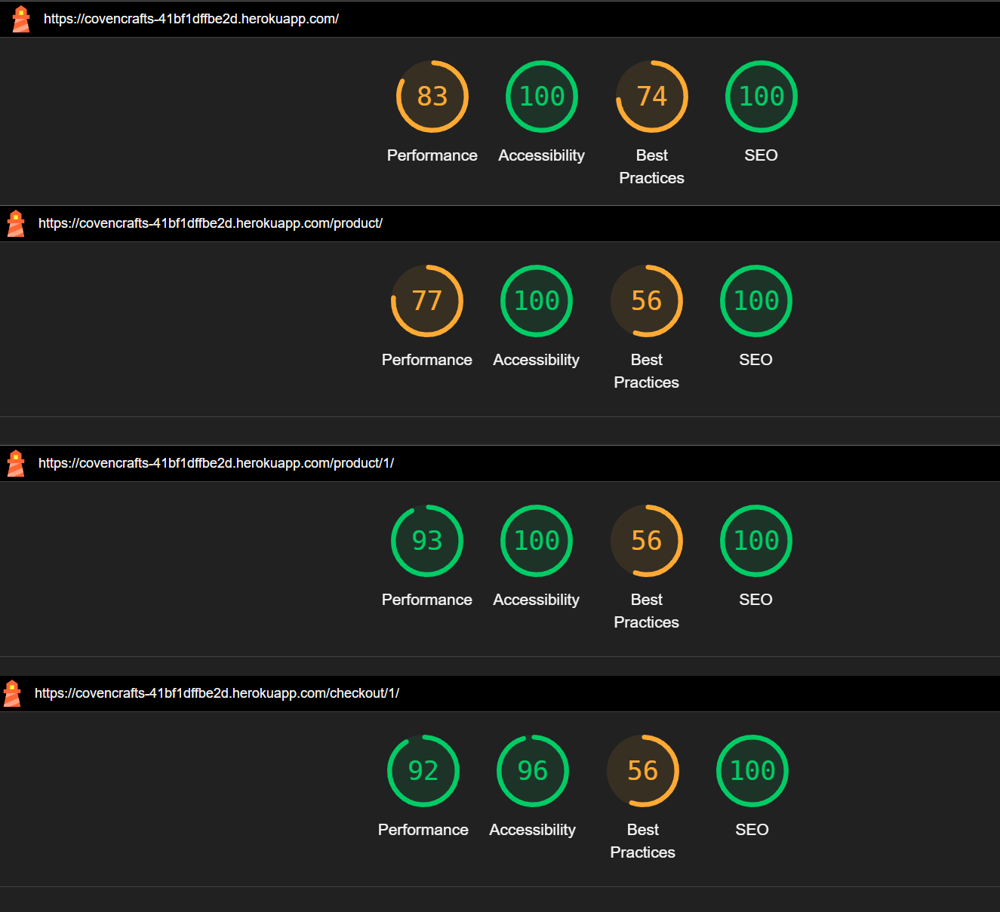

# CovenCrafts -  Testing

Visit the deployed site: [SpellSmith](https://covencrafts-41bf1dffbe2d.herokuapp.com/)

- - -

## CONTENTS

* [AUTOMATED TESTING](#automated-testing)
  * [W3C Validator](#w3c-validator)
  * [PEP8 Validator](#javascript-validator)
  * [Lighthouse](#lighthouse)
* [MANUAL TESTING](#manual-testing)
  * [Testing User Stories](#testing-user-stories)
  * [Full Testing](#full-testing)

Testing was ongoing throughout the entire SpellSmith project. Chrome developer tools were utilized while building to troubleshoot any issues I discovered.

During development I used google developer tools to ensure everything was working correctly and to assist with troubleshooting when things were not working as expected.

I utilised the search engine Phind when I encountered an issue That id didn't know the anwer too, or could not find the awnser in when reviewing the CI lessons. I also reached out to the Tutors and my fellow students on Slack. 

I have run each page through Chrome developer tools to check and confirm that each page is responsive on a variety of different screen sizes.

- - -

## AUTOMATED TESTING

### W3C Validator

[W3C](https://validator.w3.org/) was used to validate the HTML on all pages of the website. It was also used to validate the CSS.

* [Index](assets/documentation/w3_index.jpeg) - - 1 Parse Error, But no error found on observation
    * 1 There is no carriage return after `</html>`
* [Product List](assets/documentation/w3_plist.jpeg) - 3 Parse Errors, but resolving them caused the HTML to behave incorrectly 
    * 1 References a second `</script>` tag that doesn't exist when I view page source or in the text I paste over to check
    * 2 Moving these brackets to the higher line will break Js convention
    * 3 There is no carriage return after the `</html>`
* [Prodct Detail](assets/documentation/w3_pdetail.png) - 1 Parse Error, But no error found on observation
    * 1 There is no carriage return after `</html>`
* [Checkout](assets/documentation/w3_checkout.png) - 1 Parse Error, But no error found on observation
    * 1 There is no carriage return after `</html>`
* [Profile](assets/documentation/w3_profile.png) - 1 Parse Error, But no error found on observation
    * 1 There is no carriage return after `</html>`
* [Newsletter](assets/documentation/w3_newsletter.png) - 1 Parse Error, But no error found on observation
    * 1 There is no carriage return after `</html>`

* [style.css](assets/testing/w3_style.jpeg) - Passed, no errors found.

- - -

### PEP8ci Validator

[PEP8ci](https://pep8ci.herokuapp.com/#) was used to validate the Python, Due to the size of the project and many files being mostly untouched I am only validation Files over 50 lines

#### Checkout App

* [checkout/forms.py](assets/documentation/pep8_checkout_forms.jpg) - Passed.
* [checkout/models.py](assets/documentation/pep8_checkout_models.jpg) - Passed.
* [checkout/views.py](assets/testing/pep8_checkout_viewss.jpeg) - Passed.

#### Craftingcoven Project

* [craftingcovern/settings.py](assets/documentation/pep8_craftingcovern_settings.jpg)
  * 6 E501 errors due to links that cant be broken up, could use a variable but that will affect code readability
  * 1 E201 error, Format was like this when i booted up Django so im averse to tweak it.

#### Products App

* [checkout/views.py](assets/testing/pep8_product_viewss.jpeg)
  * 1 E501 errors due to links that cant be broken up, could use a variable but that will move the search logic away from the one place its used. makes sense to make it a view wide varibale if other searchbars are used.

#### Users App

* [checkout/views.py](assets/testing/pep8_product_viewss.jpeg) - Passed.
  * 1 E501 errors due to a large number of funtions being imported
  
- - -

### Lighthouse

I used Lighthouse within the Chrome Developer Tools to test the performance, accessibility, best practices and SEO of the website. All pages have 100% accessability.

On the checkout Page, there is an accessability issue regarding an aria lable being set to hidden while its descendents are selectable, this structure is generated by the Stripe API and is outside of my ability to control.

A solution would be to have something that adds the data after the DOM is loaded.

- - -

## MANUAL TESTING

### Testing User Stories

#### Site Owner

| Goals | How are they achieved? |
| :--- | :--- |
| As the Site Owner I can create, read, update and delete all products so that I can manage the site's content | CovernCrafts has an admin view in its profile dropdown that allows full CRUD for every model |

#### Customer

|  Goals | How are they achieved? |
| :--- | :--- |
| As a customer, I want to browse products so that I can find items I'm interested in purchasing. | Given the product catalog page, When I navigate through categories and filters, Then I see relevant products displayed |
| As a customer, I want to securely check out using a secure payment method so that I can complete my purchase easily.| Given the checkout form; When I select a payment method and provide required details then the transaction is processed successfully.|
| As a customer, I want to view my past orders and see the relevant order numbers | Given the profile page, When I view past orders then I see order information for each pirchase |
- - -

### Full Testing

Full testing was performed on the following devices:

* Desktop:
  * Homebuilt Rig
* Mobile Devices:
  * Samsung Galaxy S10+.

Each device tested the site using the following browsers:

* Google Chrome
* Firefox
* Google Chrome developer tools to adjust screen sizes.

Additional testing was taken by friends on a variety of devices and screen sizes. They reported no issues when navigating the site.

#### 1 All Pages

| 1 | Feature | Expected Outcome | Testing Performed | Result | Pass/Fail |
| - | --- | --- | --- | --- | --- |
| 1.1 | The Company's logo               | Link directs the user back to the home page | Clicked logo | Home page reloads | Pass |
| 1.2 | Navbar: Searchbar                | When inputted and entered, it should search all product names and descriptions | Searched for hats | returned q for hats | Pass |
| 1.3 | Navbar: All Products             | Link directs the user to the product list page returning all products | Clicked on Anchor 'All Products' | Browser navigates to list view with all prodcts | Pass |
| 1.4 | Navbar: Enchant your Familiar, Charm Your Outfit, Bewitch Your home| Link directs the user to the product list page returning products with assosiated catagores| Clicked on Anchors and below divs | Browser navigates to list view with filtered prodcts | Pass |
| 1.5 | Navbar: Logout                   | Link directs the user to the logout page | Clicked on Anchor 'Logout' while logged in | Browser navigates to logout page | Pass |
| 1.6 | Navbar: Register                 | Link directs the user to the Register page | Clicked on Anchor 'Register' while logged out | Browser navigates to register page | Pass |
| 1.7 | Navbar: Login                    | Link directs the user to the login page | Clicked on Anchor 'Login' while logged out | Browser navigates to loh page | Pass |
| 1.8 | Footer: social links             | Social buttons direct to matching socials in new tab | Clicked on social anchors | Opens the correct social page in a new tab | Pass |

#### 2 Product List

| 2 | Feature | Expected Outcome | Testing Performed | Result | Pass/Fail |
| - | --- | --- | --- | --- | --- |
| 2.1 | Product cards linked | Link directs the user to the associated product's detail view | Clicked product card | Directed to product | Pass |

#### 3 Product Detail 

| 3 | Feature | Expected Outcome | Testing Performed | Result | Pass/Fail |
| - | --- | --- | --- | --- | --- |
| 3.1 | Product data returned on view | The view should display select fields from the product model | viewed product | All expected fields present, (Name, Image URL, Description, Dimensions, price) but formatting on the text fields not present | Partial Pass
| 3.2 | Edit and Delete Buttons not visible unless logged in to a crafter or admin profile | The view shouldn't display the delete or edit buttons unless the user is logged in and they are viewing a product they created | viewed product while logged out | Buttons not present | Pass |
| 3.3 | Deleting a product | An admin or crafter should be able to delete a product via the button | delete a product | product no longer exists, warning message was displayed first | Pass |
| 3.4 | Editing a product | An admin or crafter should be able to edit a product via the button | edited a product | a instance of create a product was opened with data populated, when submitted the product was edited | Pass |

#### 4 Create a product page
| 4 | Feature | Expected Outcome | Testing Performed | Result | Pass/Fail |
| - | --- | --- | --- | --- | --- |
| 4.1 | Creating a Product | The Crafter or Admin should be able to create a product via the form | created a product | product now exists | Pass |
| 4.2 | Form validation | The form shouldn't submit if the field data is incorect and should guide the user to what needs to be changed | Tried to create a product with invalid data | form not submitted, redirected back to the page | Pass |

#### 5 Login

| 5 | Feature | Expected Outcome | Testing Performed | Result | Pass/Fail |
| - | --- | --- | --- | --- | --- |
| 5.1 | Create a User | Able to create a user | followed instructions to create a user | User was created | Pass |
| 5.2 | Login as a user | Able to login | followed instructions to login | User was authenticed | Pass |
| 5.3 | Logout as a user | Able to logout | followed instructions to logout | User was signed out | Pass |

#### Checkout

| 6 | Feature | Expected Outcome | Testing Performed | Result | Pass/Fail |
| - | --- | --- | --- | --- | --- |
| 6.1 | Make a Purchase | Able to make a purchase | Entered test data for Stripe: 4242 4242 4242 4242 + any future dated expiary + Any CVC + any Zip | Order was created, recorded in Stripe | Pass |
| 6.2 | Checkout form validation | Unable to submit with faulty address data | entered test with bad data | order went through | Fail | raised #30 to resolve